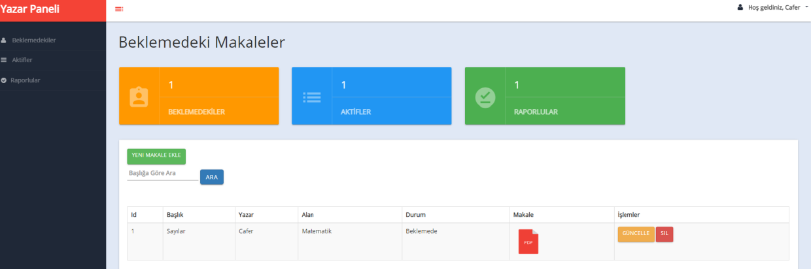
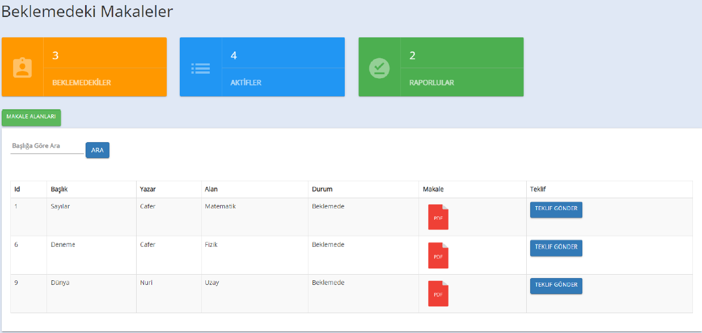
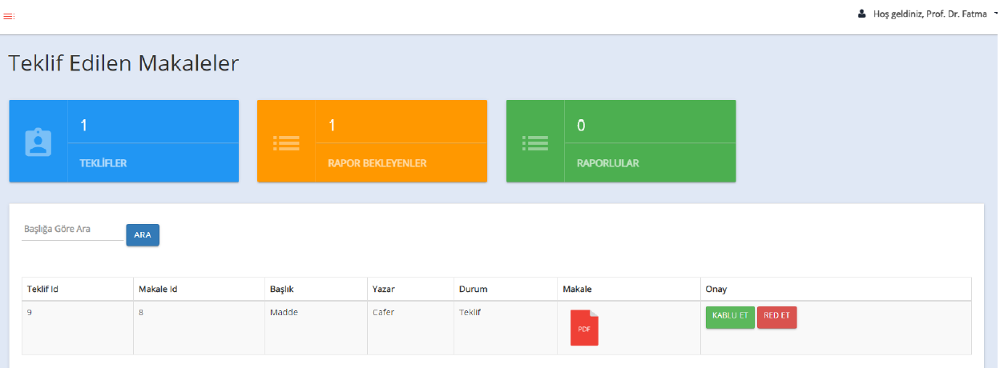

# Java JSP Artical Management System

Management of the reporting process of articles by experts.

## Used Tools
- Java Server Pages (JSP)
### Web Server
- Apache Tomcat
### Database
- MS SQL Server 

## Features
- Multiple admin control.
- Email notification system.
- MD5 encryption for passwords.

> ⚠️ For more details: [Report](./report.pdf)

## Screenshots
### Author

   

### Admin

  

### Expert

  

## License
MIT

